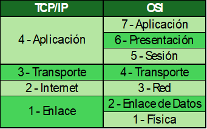
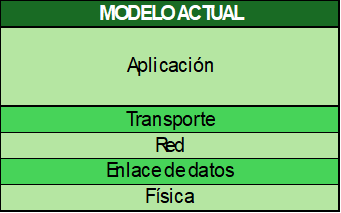

# Networking

Es el método por el cual podemos comunicar 2 o mas dispositivos capaces de unirse a una red.

Se pueden tener visiones o niveles de abstracción en redes:
- Usuario doméstico.
- Usuario Corporativo.
- Técnico en Redes.

Hay dos tipos de dispositivos en una red:
- Equipos finales: utilizados por un usuario, a estos también se les conoce como terminales.
- Equipos de red: los que logran hacer funcionar la red, normalmente son manipulados solo por los técnicos de red.

Y todos estos equipos finales y de red se van a interconectar mediante un enlace, el cual puede ser a través de cable de cobre, fibra óptica o radiofrecuencia.  Hasta aquí han sido sólo los requerimientos de hardware necesarios para formar una red, pero sólo con estos no es posible hacerla funcionar, nos falta la parte lógica, el software, como todo sistema computacional, este software son los protocolos y estandares de red, que son desarrollados por organismos como el IEEE (Institue of Electrical and Electronic Engineers) y el IETF (Internet Engineering Task Force).

## Protocolos de Red
Son las reglas y pasos que deben seguir los dispositivos para poder tener una comunicación efectiva.

## Estandares de Red
Son medidas, formas, tipos de conexión, etcetera, que deben tener los dispositivos y enlaces para poder trabajar dentro de la red; esto se hace y se utiliza de manera recurrente y extendida.

## Modelos de Red

Los modelos de red se utilizan para estudio, comprehensión, administración y correccion de fallos de una red, éstos estan conformados por capas que estan estrechamente relacionadas entre si de manera sucesiva, es decir que una no puede funcionar sin la capa anterior, son muy importantes para poder discernir en que etapa se encuentra algun fallo.

 

 

Estos modelos (TCP/IP y OSI) habian sido antiguamente la forma con la que se ha organizado la estructura de los protocolos y estandares para hacer funcionar la red, hoy en dia se utiliza una fusion de las dos para nuestro mismo proposito, el cual es entender el funcionamiento de las redes.  

 

 

Hoy en dia el Model OSI es utilizado para el estudio de y entendimiento de la red.  
Y el modelo actual es el que nos ayuda a administrar la red.