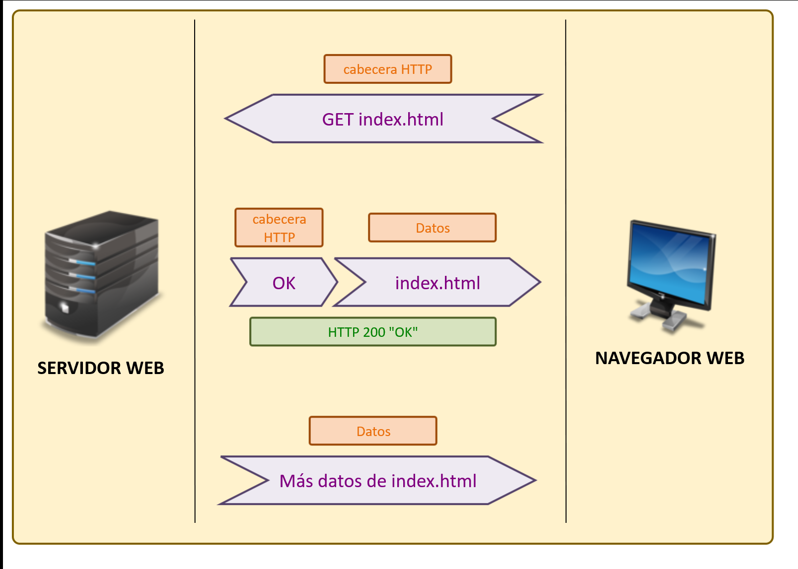
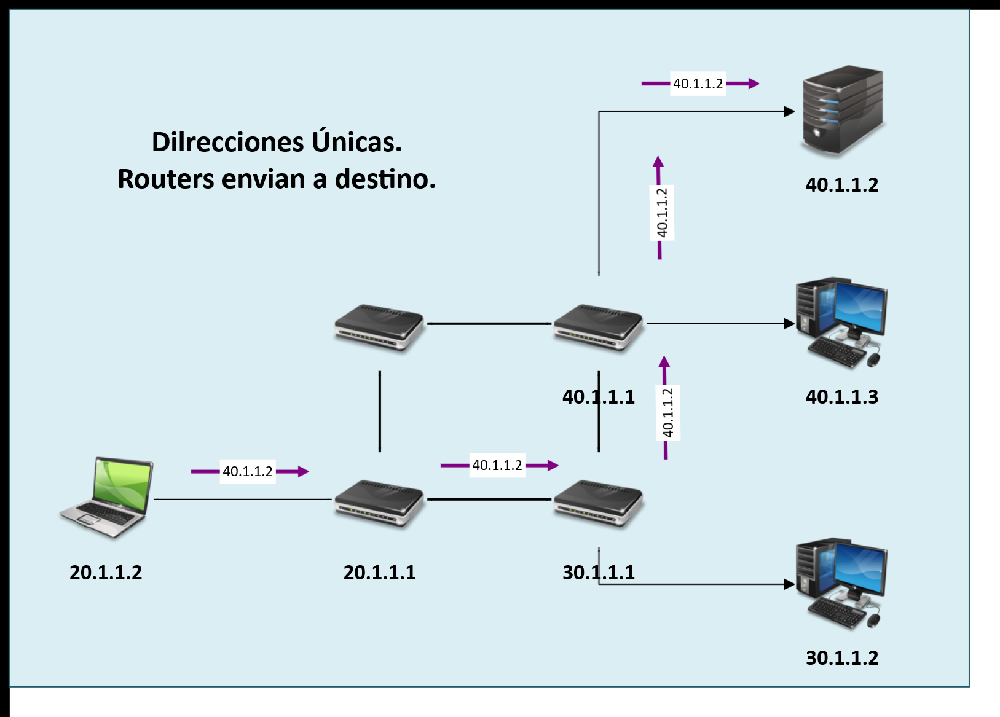

# Modelo TCP/IP Actual.

 

## Capa de Aplicación.
- Protocolos que proporcionan servicios a las aplicaciones.
- No define la aplicación en sí, solo los servicios que dichas aplicaciones necesitan 

### Modelo Cliente/Servidor.

 

 
 

## Capa de transporte

Nos encontramos con 2 protocolos:

- `TCP`: Transmission Control Protocol (Protocolo de Control de Transmisión).
- `UDP`: User Datagram Protocol (Protocolo de datagrama del usuario).

Estos protocolos proporcionan servicios a los protocolos de la capa superior que es la de aplicación.

### Servicios que proporcionan

- **Recuperación de errores**
- **Control de flujo**
- **Multiplexación**

 
 

## Capa de red

En esta capa tenemos solo un protocolo, el mas iportante:

- `IP`: Internet Protocol (Protocolo de Internet)

Esta capa nos proporciona servicios de :

- **Enrutamiento**: En donde los routers fungen como los encargados de controlar las rutas por donde la información tine que transitar para poder llegar a su destino.
- **Direccionamiento**: Proporciona las direcciones únicas (En forma de octetos, `192.169.1.1`) a todos los dispositivos que funcionan a nivel de esta capa.

Cada dispositivo se conecta con una dirección única, esto es el direccionamiento, y los routers se encargan de escoger la mejor ruta para comunicar los dispositivos entre ellos, esto es el enrutamiento.

Esta decisión de las rutas para enviar los datos se llama **ROUTING** (Reenvio/Forwarding.)

 
 

## Capa de enlace de datos y capa física

La **capa de enlace de datos** maneja protocolos y normas de control de acceso y uso del medio, aquí se leen direcciones físicas proporcionadas por los fabricantes a las interfaces de red, para poder conectar los dispositivos entre si.

La **capa física** como su nombre lo indica es la interconexión de los dispositivos de manera física, existen estandares que determinan el tipo de conexión, el mas utilizado es el IEEE 802.3 o mejor conocido como ethernet, el cual es conexión por cable de cobre de 4 pares; también existe el IEEE 802.3db de la fibra óptica y el IEEE 802.11 para conexiones inalámbricas.