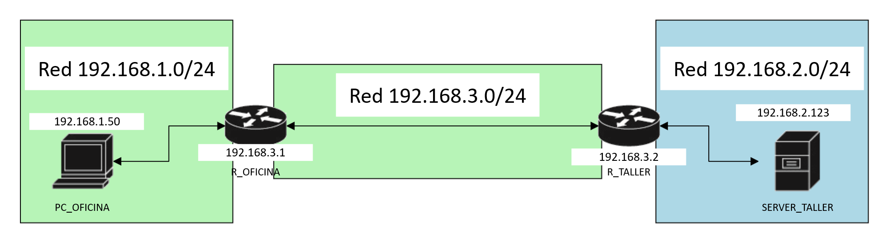

# Configurar una ruta estatica

Cuando tiene que haber mas de un salto entre redes, los routers no son capaces de identificar la red a la que se quiere conectar algun dispositivo dentro de su propia red con otra en la que se encuentra gestionandola otro router. Es por eso que se tienen que agregar rutas estaticas a su tabla de rutas para poder direccionar su trafico interno, hacia otro router.

Para configurar la ruta estatica se hace de siguiente manera en la terminal (routers cisco):
~~~
router> enable
router# configure terminal
router(config)# ip route x.x.x.x y.y.y.y z.z.z.z
~~~
En donde:
- x.x.x.x es la ruta a la que queremos llegar
- y.y.y.y es la mascara de subred de dicha red
- z.z.z.z la ruta por donde llegaremos hacia esa red

Ejemplo:
En esta estructura de red, tenemos 2 redes administradas por 1 router cada una, dichos routers estan interconectados entre si creando una tercera red:

Haremos lo siguiente:
~~~
R_OFICINA(config)# ip route 192.168.2.0 255.255.255.0 192.168.3.2
~~~
Configuramos la ip 192.168.3.2 del router R_TALLER como la ruta que seguira R_OFICINA para poder llegar a la red de destino 192.168.2.0 con mascara de subred 255.255.255.0

Para poder verificar la tabla de rutas, podemos utilizar este comando:
~~~
router> enable
router# show ip route
~~~